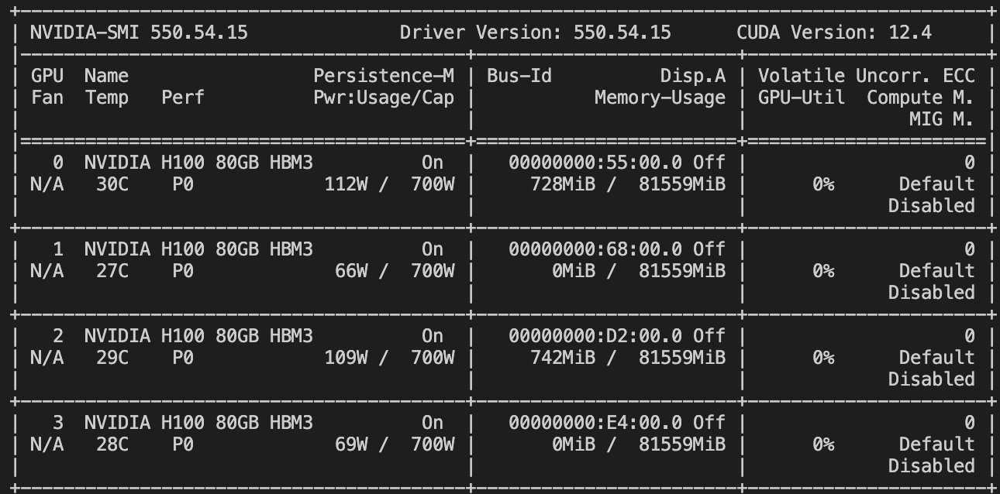
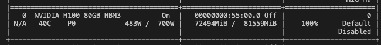

# Li Lab Rotation
Tutorial to reproduce work done during Li Lab rotation

## Contents
1. [Model Comparisons](https://github.com/IrenaeusChan/LiLabRotation?tab=readme-ov-file#1-model-comparisons)
2. [Prepare Data for Pre-Training](https://github.com/IrenaeusChan/LiLabRotation?tab=readme-ov-file#2-prepare-pre-training-data)
3. [Pre-Train DNABERT-2](https://github.com/IrenaeusChan/LiLabRotation?tab=readme-ov-file#3-pre-train-dnabert2)
4. [Fine-Tune DNABERT-2](https://github.com/IrenaeusChan/LiLabRotation?tab=readme-ov-file#4-finetune-dnabert2)
5. [Compare](https://github.com/IrenaeusChan/LiLabRotation?tab=readme-ov-file#5-compare)

## 1. Model Comparisons
For each of the foundation models used in this overview, please refer to their individual Github repositories for installation and usage:  
[DNABERT](https://github.com/jerryji1993/DNABERT)  
[DNABERT-2](https://github.com/MAGICS-LAB/DNABERT_2)  
[Nucleotide-Transformer](https://github.com/instadeepai/nucleotide-transformer)

However, for most of the work done here we will be using the already pre-trained models which are available on Huggingface

### 1.1. Setup conda environment

There will be two different conda environments that are required for performing the tasks shown here. The first of which will be dnabert-2 which is simply following the installation instructions provided by DNABERT_2 Github README page.
```
# Create and activate the virtual python environment
conda create -n dnabert-2 python=3.8
conda activate dnabert-2

# Install required packages (the requirements.txt will be provided from https://github.com/MAGICS-LAB/DNABERT_2)
python3 -m pip install -r requirements.txt

# Uninstall Triton - For some reason the Flash Attention from Triton is no longer compatible so we just uninstall it
# Refer to issue: https://github.com/MAGICS-LAB/DNABERT_2/issues/123
python3 -m pip uninstall triton

# Update transformer package to the most recent transformer
python3 -m pip install upgrade transformers

# Test to see if the conda environment works properly
python3 check_dnabert-2_install.py
```

### 1.2. To compare and evaluate the models performance, we will be evaluating the data on GUE

Please download the GUE dataset from [here](https://drive.google.com/file/d/1GRtbzTe3UXYF1oW27ASNhYX3SZ16D7N2/view?usp=sharing). 

We will need to do some pre-processing on the GUE inputs for DNABERT which expects the data to be organized as kmers and JSON files (the current inputs from the GUE download are organized as CSV). 

Here is an example to generate a 3mer JSON for all of the CSV inputs. Replace 3 with whichever k-mer you want (e.g. 6).
```
for dir in $(ls -d GUE/); do
  for subdir in $(ls -d $dir/*); do
    for csv in $(ls $subdir/*.csv); do
      python $scripts/generate_kmer_inputs.py $csv 3;
    done;
  done;
done
```
Then run the scripts to evaluate on all of the tasks.  
The following scripts are adapted from [DNABERT-2 Finetune Step](https://github.com/MAGICS-LAB/DNABERT_2?tab=readme-ov-file#6-finetune) but adapted to the current LSF infrastructure that is current being used at WashU. Additionally there are some modifications for the train.py script to match the GUE dataset
```
# Finetune ALL models on the GUE dataset
LSF_DOCKER_PRESERVE_ENVIRONMENT=false \
PATH="/opt/conda/bin:/opt/coda/bin:$PATH" \
bsub \
-q subscription \
-G compute-yeli-t2 \
-sla yeli_t2 \
-n 8 \
-M 32 \
-R "select[gpuhost] span[hosts=1] rusage[mem=32G]" \
-gpu "num=1:gmodel=TeslaV100_SXM2_32GB" \
-o out_dnabert1_finetune.log \
-a "docker(kboltonlab/dnabert-2:1.0)" \
/bin/bash conda_submit_models_finetune.sh
```

NOTE: When Finetuning the data, there are three parameters to set:  
--per_device_train_batch_size 2  
--per_device_eval_batch_size 4  
--gradient_accumulation_steps 4  

As a rule of thumb
> global_batch_size = per_device_train_batch_size * gradient_accumulation_steps * num_gpus

Therefore, if we have 4 GPUs, this would be:
```
--per_device_train_batch_size 2
--per_device_eval_batch_size 4
--gradient_accumulation_steps 4
```

If we have only 1 GPU, this would be:
```
--per_device_train_batch_size 32
--per_device_eval_batch_size 64
--gradient_accumulation_steps 1
```

OR

```
--per_device_train_batch_size 16
--per_device_eval_batch_size 32
--gradient_accumulation_steps 2
```

### 1.3. Compare Results
In an interactive session activate the conda environment dnabert-2. You will probably have to install additional packages like pandas and matplotlib, I can't actually remember which ones you will need but install whichever packages are missing and then run
```
python3 scripts/summarise_results.py /path/to/output/directories/ finetune
```
[The result will look like this](https://github.com/IrenaeusChan/LiLabRotation/blob/main/pdf/models_matthews_correlation_plot.pdf)

## 2. Prepare Pre-Training Data
There was two training datasets available for me to prepare the pre-training data.  
435 WES Glioblastoma BAM Files by Eric Leuthardt: /storage1/fs1/leuthardte/Active/Patrick/genetics/WholeGenomeGBM/  
46 WGS Glioblastoma BAM Files by _______: /storage2/fs1/btc/Active/yeli/SHARED/WGS_WGBS_GBM/20240108_tumor_normal_WGS/  

### 2.1. Re-align BAM files to hg38 from hg19

Using [Heng Li's blog post](https://lh3.github.io/2021/07/06/remapping-an-aligned-bam) as a template, we use the hengli_realign.sh script to realign our hg19 BAMs into hg38 BAMs as follows
```
cat BAM_ids.txt | while read id; do 
  echo $id;
  input_bam=/storage1/fs1/yeli/Active/chani/Data/Leuthardt_WGS_GBM_gVCFs/BAMs/WholeGenomeGBM/${id}.sorted.bam;
  sample_name=$(basename $(basename ${input_bam} .bam) .cram);
  bsub8 fredhutch/bwa:0.7.17-samtools-1.10 scripts/hengli_realign.sh ${input_bam} HG38_BAMs/${sample_name}.hg38.bam
done
```

Unfortunately, due to some issues with the original BAM files we need to fix the header
```
for in_bam in HG38_BAMs/*.bam; do
  samtools view -H ${in_bam} | \
  awk '!/all_sequences.fa/' | \
  samtools reheader - ${in_bam} > FIXED_HG38_BAMs/${in_bam};
done
```

### 2.2. Perform Variant Calling with DeepVariant 
Using Google's DeepMind Variant Caller - [DeepVariant](https://github.com/google/deepvariant)

This variant caller can leverage the use of GPUs to speed up the variant calling workflow and produce similar results to GATK for Illumina based sequencing platforms.

For the 435 WES GBM Files
```
GBM_gVCFs=gVCFs_Output/
for in_bam in FIXED_HG38_BAMs/*.bam; do 
  echo $in_bam;
  LSF_DOCKER_NETWORK=host LSF_DOCKER_RUN_LOGLEVEL=DEBUG LSF_DOCKER_VOLUMES="$LSF_DOCKER_VOLUMES" \
  bsub \
  -n 16 \
  -M 256GB \
  -R 'rusage[mem=256GB] span[hosts=1] select[gpuhost]' \
  -G compute-yeli-t2 \
  -q subscription \
  -sla yeli_t2 \
  -o Logs/$(basename $(basename ${in_bam} .bam) .cram).log \
  -gpu "num=1:j_exclusive=yes:gmodel=TeslaV100_SXM2_32GB" \
  -a 'docker(nvcr.io/nvidia/clara/clara-parabricks:4.0.0-1)' \
  /bin/sh -c "pbrun deepvariant --ref ${HG38_REF} --tmp-dir /tmp_dir/ --num-gpus 1 --in-bam ${in_bam} --out-variants ${GBM_gVCFs}/$(basename $(basename ${in_bam} .bam) .cram).g.vcf.gz --gvcf";
done
```

For the 46 WGM GBM Files
```
for dir in $(ls -d WGS_CRAM_DIRECTORY/*); do
  sample_name=$(basename $dir);
  echo $sample_name;
  GBM_gVCFs=WGS_GBM_gVCFs_Output/;
  input_bam=/storage2/fs1/btc/Active/yeli/SHARED/WGS_WGBS_GBM/20240108_tumor_normal_WGS/${sample_name}/${sample_name}.cram;
  LSF_DOCKER_NETWORK=host LSF_DOCKER_RUN_LOGLEVEL=DEBUG LSF_DOCKER_VOLUMES="$LSF_DOCKER_VOLUMES" \
  bsub \
  -n 16 \
  -M 256GB \
  -R 'rusage[mem=256GB] span[hosts=1] select[gpuhost]' \
  -G compute-yeli-t2 \
  -q subscription \
  -sla yeli_t2 \
  -o Logs/$(basename $(basename ${input_bam} .bam) .cram).log \
  -gpu "num=1:j_exclusive=yes:gmodel=TeslaV100_SXM2_32GB" \
  -a 'docker(nvcr.io/nvidia/clara/clara-parabricks:4.0.0-1)' \
  /bin/sh -c "pbrun deepvariant --ref ${HG38_REF} --tmp-dir /tmp_dir/ --num-gpus 1 --in-bam ${input_bam} --out-variants ${GBM_gVCFs}/$(basename $(basename ${input_bam} .bam) .cram).g.vcf.gz --gvcf";
done
```
Running this command took over 2 hours:
```
[PB Info 2024-Nov-29 00:51:43] ------------------------------------------------------------------------------
[PB Info 2024-Nov-29 00:51:43] ||        Program:                                       deepvariant        ||
[PB Info 2024-Nov-29 00:51:43] ||        Version:                                           4.0.0-1        ||
[PB Info 2024-Nov-29 00:51:43] ||        Start Time:                       Thu Nov 28 22:40:14 2024        ||
[PB Info 2024-Nov-29 00:51:43] ||        End Time:                         Fri Nov 29 00:51:43 2024        ||
[PB Info 2024-Nov-29 00:51:43] ||        Total Time:                         131 minutes 29 seconds        ||
```

### 2.3. Create a gVCF for the GBM Population
In order to finetune the data later on, we need to identify variants that are specifically GBM related. We can create this by assuming our 435 Samples are a small GBM population. Each sample will have unique rare somatic mutations as well as common germline mutations. However, there will be some mutations that are common between all GBM patients. These are the mutations that may potentially define GBM from regular samples. As such, we utilize [GLNexus by Regeneron Genetics Center](https://github.com/dnanexus-rnd/GLnexus) to perform gVCF merging and joint variant calling for population level sequencing.

For the 435 WES GBM Files
```
bsub \
  -o "Logs/glnexus.log" \
  -G compute-yeli \
  -q general \
  -n 16 \
  -R 'select[mem>256G] span[hosts=1] rusage[mem=256G]' \
  -a 'docker(kboltonlab/glnexus)' \
    /bin/bash -c 'gvcfs=($(find $PWD -maxdepth 2 -mindepth 1 -type f -name "*.g.vcf.gz")); \
    glnexus_cli --dir /storage1/fs1/yeli/Active/chani/Data/Leuthardt_WGS_GBM_gVCFs/gVCFs/GLNexusDB --config deepvariant ${gvcfs[@]} > GBM.combined.bcf; '
```

Do the same for the 46 WGS GBM Files

The results for this can be found [here](https://github.com/IrenaeusChan/LiLabRotation/blob/main/pdf/ManhattanPlotsWES.pdf)

This plot was generated using the scripts/create_manhattan_plots.R

### 2.4. Create Sample FASTA Files
For the pre-training, we want to feed in sequences from GBM patients in hope that the model can learn small details behind mutations that appear within GBM patients. In order to do this we want to create FASTA files for each individual patient and use these FASTA files as additional training data for the model to learn what sequences look like within GBM patients specifically. 

Therefore, using the gVCF file that we created previously we will mutate the original HG38 reference file to incorporate all the additional mutations that have been called by DeepVariant
```
for gvcf in GBM_gVCFs/*.g.vcf.gz; do
  sn=$(basename $gvcf .g.vcf.gz);
  sample_name=$(zcat ${gvcf} | grep -m 1 "#CHROM" | cut -f 10);
  bsub \
  -n 1 \
  -G compute-yeli \
  -q general \
  -o out.log \
  -M 8G \
  -R 'select[mem>8G] span[hosts=1] rusage[mem=8G]' \
  -a 'docker(kboltonlab/bst:1.0)' \
  bcftools consensus -s ${sample_name} -f ${HG38_REF} -o IndivFasta/${sn}.fa ${gvcf};
done
```

For this specific project, due to time constraints we performed this on the 435 WES GBM samples. Therefore, we don't want to feed in redudant information so we want to extract the only the exonic regions only. This is done by using the bed file provided in resources/ which was created by downloading the GTF file from gencode v44 and extracting the exonic regions for every single gene within gencode v44. In order to have a buffer, we also included 100bp padding on each side of the exon to account for longer insertions and deletions. 

```
for fasta in IndivFasta/*.fa; do
  sn=$(basename $fasta .fa);
  bsub \
  -n 1 \
  -G compute-yeli \
  -q general \
  -o out.log \
  -M 8G \
  -R 'select[mem>8G] span[hosts=1] rusage[mem=8G]' \
  -a 'docker(kboltonlab/bst:1.0)' \
  bedtools getfasta -fi ${fasta} -bed resources/gencode.v44.hg38.exome_w100padding.bed -fo IndivFastaExome/${sn}.exome_w100padding.fa;
done
```

This creates individual FASTA files that have been separated by their exomes like this:
```
>chr1:65318-65673
TCTCACTCAGGAAAATTCTGTGTGTTTTCTCTAATGGCCAAGGGAAAACTTGTGAGACTATAAAAGTTAGTCTCAGTACACAAAGCTCAGACTGGCTATTCCCAGATCTCTTCAGGTACATCTAGTCCATTCATAAAGGGCTTTTAATTAACCAAGTGGTTTACTAAAAAGGACAATTCACTACATATTATTCTCTTACAGTTTTTATGCCTCATTCTGTGAAAATTGCTGTAGTCTCTTCCAGTTATGAAGAAGGTAGGTGGAAACAAAGACAAAACACATATATTAGAAGAATGAATGAAATTGTAGCATTTTATTGACAATGAGATGGTTCTATTAGTAGGAATCTATTCTG
>chr1:68936-71685
GATTATAGAAAGTCACTGTAAGAGTGAGCAGAATGATATAAAATGAGGCTTTGAATTTGAATATAATAATTCTGACTTCCTTCTCCTTCTCTTCTTCAAGGTAACTGCAGAGGCTATTTCCTGGAATGAATCAACGAGTGAAACGAATAACTCTATGGTGACTGAATTCATTTTTCTGGGTCTCTCTGATTCTCAGGAACTCCAGACCTTCCTATTTATGTTGTTTTTTGTATTCTATGGAGGAATCGTGTTTGGAAACCTTCTTATTGTCATAACAGTGGTATCTGACTCCCACCTTCACTCTCCCATGTACTTCCTGCTAGCCAACCTCTCACTCATTGATCTGTCTCTGTCTTCAGTCACAGCCCCCAAGATGATTACTGACTTTTTCAGCCAGCGCAAAGTCATCTCTTTCAAGGGCTGCCTTGTTCAGATATTTCTCCTTCACTTCTTTGGTGGGAGTGAGATGGTGATCCTCATAGCCATGGGCTTTGACAGATATATAGCAATATGCAAGCCCCTACACTACACTACAATTATGTGTGGCAACGCATGTGTCGGCATTATGGCTGTCACATGGGGAATTGGCTTTCTCCATTCGGTGAGCCAGTTGGCGTTTGCCGTGCACTTACTCTTCTGTGGTCCCAATGAGGTCGATAGTTTTTATTGTGACCTTCCTAGGGTAATCAAACTTGCCTGTACAGATACCTACAGGCTAGATATTATGGTCATTGCTAACAGTGGTGTGCTCACTGTGTGTTCTTTTGTTCTTCTAATCATCTCATACACTATCATCCTAATGACCATCCAGCATCGCCCTTTAGATAAGTCGTCCAAAGCTCTGTCCACTTTGACTGCTCACATTACAGTAGTTCTTTTGTTCTTTGGACCATGTGTCTTTATTTATGCCTGGCCATTCCCCATCAAGTCATTAGATAAATTCCTTGCTGTATTTTATTCTGTGATCACCCCTCTCTTGAACCCAATTATATACACACTGAGGAACAAAGACATGAAGACGGCAATAAGACAGCTGAGAAAATGGGATGCACATTCTAGTGTAAAGTTTTAGATCTTATATAACTGTGAGATTAATCTCAGATAATGACACAAAATATAGTGAAGTTGGTAAGTTATTTAGTAAAGCTCATGAAAATTGTGCCCTCCATTCCCATATAATTTAGTAATTGTCTAGGAACTTCCACATACATTGCCTCAATTTATCTTTCAACAACTTGTGTGTTATATTTTGGAATACAGATACAAAGTTATTATGCTTTCAAAATATTCTTTTGCTAATTCTTAGAACAAAGAAAGGCATAAATATATTAGTATTTGTGTACACCTGTTCCTTCCTGTGTGACCCTAAGTTTAGTAGAAGAAAGGAGAGAAAATATAGCCTAGCTTATAAATTTAAAAAAAAATTTATTTGGTCCATTTTGTGAAAAACATAAAAAAAGAACTGTCACATCTTAATTTAAAAAATATATGCTTAGTGGTAAGGAGATATATGTCAACTTTTAAGAGGTTGAAAAACAAACGCCTCCCATTATAAGTTTATACTTCACCTCCCACCACTATAACAACCCAGAATCCATGAGGGCATTATCAGGAGTGAGTGGAAGAGTAAGTTTGCCAATGTGAAATGTGCCTTCTAGGTCCTAGACGTCTGTGGTATAACTGCTCATAAGCAGTAGAAAGAATTTAGAGGGATCCAGGCTCTCATCACGTTGGCACAAAGTATATTACTTGGATCCATCTATGTCATTTTCCATGGTTAATGTTTAAAAGCACAGGCTTTAAAGTAAAAAACAAAGAGCTGGATTCAACTCTACTGACTCTTATTAATCATGATTTTGGGCACATTACGTAGCTTTCATGAGCTTTAGTTTCTACATTTATAAACAGGAGATTATACCTATTATGCATGGTTATTATGAAGGAAAATGACAAAATAGATATAAATCAAATAGCCCACTTCGAGACATATTAAGCATGAATAAACATTAGATACTATTAAAATCCTATATATTAACAAAGCCAAAAGTTTCAAACTTTACTTTTTCCCAACATTCTTGTGAAATATGACACATCCCAATCTTAACAGATGCTCATTTGGGATACTGTACTTGTGAGTGGAAGTGTGTATATTTGTGTGCAAGTGTGTACTCATATACTTCCACCTTACCACCCTAGAAAGGCATGATGAAAATTTAAGATAGAAGGAAAATATAAATTGAAAAAAAAAAACCTTAACAAATGATTCTGACAAATATCTTCTCTTTCCAGGGAGAATCACTGAGCCAGAATAAAATTGAACACTAAATATTCTAAGAAAAAAGGAATCTAGTTTGTCAAAATGTGACTTGAATTAATAGATAAGGAGAGTCAGATGATAAGAGGGTCAAAATTATGTTTATCTTAGGAAAAGTAGAATAGAAAATTTATAAGCAGATTAAAAACACATAATAAAAGTAGTAAATAATAATGACAGTATCTCAAATCAGTGCAGGGGGGAAAGGCCTACTAATGTGATGGTGGGATAATTGGATAGCAATATGGGAAAAGATATATTTAATTTATTTGCTACACCAAATGCCAGGACAATCTCTAAGTGAATTCAAGACATAACTCTTTTTTCAAAAAAACTATGCAAATATTAAAAGAAAACAAGTTAATGTTTTTATAATCTATGAATATGGTAAAGATGGATAACATTGACTATCAAATTAATTTTTAATGCGTAATA
>chr1:450639-451778
TCAAATCAATACATAATGTCTCATAGTTCCTGAATCTAAAATATCAAAGAAAGAAACATAAAGCCATATCATGTTTAATGAGAAGGGCTTATTATATCATTTATGAGATCCTCTTGTAAATCACTAGCTGTTTGCATACTCTCTTTATTGCTGCCTTCATCTCCTTATTCCTGAATGTATAGACAACTGGATTCAGAAAAGGAGTGAGAACTGCATCAAAAATAGCCAGAAACTTGTCCATCTGTGAATTAGGGTGTGGCCGTGTATACACAAACATGGGTGGACCAAAGAACAAAAGGACCACTGTGCTGTGAGCTGAAAGAGTGGAAAGGGCCTTGGATGAACCACCTGAGGAATGTTTCCAAACAGTAAACAGGATGAAGACGTAGGAGATTAGAAGTATGAAGAAAGTACCCACACAGATAAACCCACTGTTAACAGTGACCATGAACTGCAATCTGTAGGTGTCGGTACAGGCTAGTCTGAGAAGCCGAGGAAGGTCACAGTAGAAGCTGTCCAACACATTAGGGCCACAGAAGGCTAAATTAACAAGAAATGCCAGTTGGAACAGGGAGTGACTGACACCAAGGGTCCAGGCAACAGCCAGAAATGAAAGGCACATTCTTGGGCTCATAATGGTCAGATAGTGGAGGGGCTTACATAGGGCCACATATCTGTCAAAGGCCATGGCTATGAGCAGCACCATCTCCACACCACCAACGACGTGGATGAAGAAGATTTGAGCGATGCAGCCTCCAAAGGAGATGACTTTGCGCTTTCTGAACAGGTCATAAATCATCTTGGGAGAAGTGACAGAGCAGGCTCCTAAGTCAATGAAGGAGAGACTGGCCAGTAGAAAGTACATGGGGGAGTGTAAGTGAGGGTCAGTGGTCACAGAAAACACAATGAGGATGTTTCCAGTAATGCTTGCCACATAGAGCACAGAGGAAAACACTAGGAGGAGGAGCTGGATCTCCCATGAATGAGTGAGTCCCAGAAACAAAAACTCAGATACCACTGAGTGATTCTCTCCATCCATTGGTCCAGCCAACTGGGCTGTGGCTAAAATTATGAGAACTAAGAAAATGGGGAGGAAATTGTGATTATGAAGATAATAATATGTACTAAAATCAATATTG
>chr1:685615-686754
TCAAATCAATACATAATGTCTCATAGTTCCTGAATCTAAAATATCAAAGAAAGAAACATAAAGCCATATCATGTTTAATGAGAAGGGCTTATTATATCATTTATGAGATCCTCTTGTAAATCACTAGCTGTTTGCATACTCTCTTTATTGCTGCCTTCATCTCCTTATTCCTGAATGTATAGACAACTGGATTCAGAAAAGGAGTGAGAACTGCATCAAAAATAGCCAGAAACTTGTCCATCTGTGAATTAGGGTGTGGCCGTGTATACACAAACATGGGTGGACCAAAGAACAAAAGGACCACTGTGCTGTGAGCTGAAAGAGTGGAAAGGGCCTTGGATGAACCACCTGAGGAATGTTTCCAAACAGTAAACAGGATGAAGACGTAGGAGATTAGAAGTATGAAGAAAGTACCCACACAGATAAACCCACTGTTAACAGTGACCATGAACTGCAATCTGTAGGTGTCGGTACAGGCTAGTCTGAGAAGCCGAGGAAGGTCACAGTAGAAGCTGTCCAACACATTAGGGCCACAGAAGGCTAAATTAACAAGAAATGCCAGTTGGAACAGGGAGTGACTGACACCAAGGGTCCAGGCAACAGCCAGAAATGAAAGGCACATTCTTGGGCTCATAATGGTCAGATAGTGGAGGGGCTTACATAGGGCCACATATCTGTCAAAGGCCATGGCTATGAGCAGCACCATCTCCACACCACCAACGACGTGGATGAAGAAGATTTGAGCGATGCAGCCTCCAAAGGAGATGACTTTGCGCTTTCTGAACAGGTCATAAATCATCTTGGGAGAAGTGACAGAGCAGGCTCCTAAGTCAATGAAGGAGAGACTGGCCAGTAGAAAGTACATGGGGGAGTGTAAGTGAGGGTCAGTGGTCACAGAAAACACAATGAGGATGTTTCCAGTAATGCTTGCCACATAGAGCACAGAGGAAAACACTAGGAGGAGGAGCTGGATCTCCCATGAATGAGTGAGTCCCAGAAACAAAAACTCAGATACCACTGAGTGATTCTCTCCATCCATTGGTCCAGCCAACTGGGCTGTGGCTAAAATTATGAGAACTAAGAAAATGGGGAGGAAATTGTGATTATGAAGATAATAATATGTACTAAAATCAATATTG
>chr1:923822-925048
CCGGATGCCCCGAGTCGGCCGTCACGCACCCCCCGCGGGAGCCCGCGCCGCCCGCCGCGCCGGGGCCGTTTAAATGGGCCAAGTTGTGGCGGCGGCGTCGGCGGCGGAGTCTCCCAAGTCCCCGCCGGGCGGGCGCGCGCCAGTGGACGCGGGTGCACGACTGACGCGGCCCGGGCGGCGGGGCGGGGGCTTGGGACCCCCGAGAGGGGCGGGGACTCCGCGACTCCTCGCTGCCGGGCTCGGCCTGGCGGGTGGGTCGGCGAGCCGGGCGTGGGACTGCCCCGGGCGCGGGCGCTGGTGGCCGGGGCGCGGGACTCCAGACGCCCCGGGGAGCCCCGAGGCCCTGGAACTGCGGCGCTCGGCGAGTCGATCCGGGATCGATAGCAGCTCCATGTCTCCGGCCTCTGAGGCCCCGCCGGCCGGCTGGGCAGTCCGGGGAGGCCTGGCGGGCGGCGCGTAGGCGGCGGCTGCGGGCGCCGGGACGCAGTAGCGGACGGGGTGGGCGCGCGGCCAGGCGCCTCCCCGGCCCCCGCGACCCAACTCCAGCCCGGGCCGGAATAAGTTGCTGCCGCCGGCGGAGAGCGGGGCTGCGGAGCCACCGGGGCGCCATGCCGGCGGTCAAGAAGGAGTTCCCGGGCCGCGAGGACCTGGCCCTGGCTCTGGCCACGTTCCACCCGACCCTGGCCGCGCTGCCGCTGCCGCCGCTGCCGGGCTACCTGGCGCCACTGCCCGCGGCGGCCGCCCTCCCCCCGGCCGCCTCGCTGCCCGCCTCGGCCGCCGGTTACGAGGCTCTGCTGGCCCCGCCGCTCCGCCCCCCGCGCGCCTACCTCAGCCTGCACGAGGCCGCCCCGCACCTCCACCTGCCCAGGGACCCGCTGGCCCTCGAGCGCTTCTCGGCCACCGCGGCCGCGGCCCCGGATTTCCAGCCGCTGCTGGACAACGGCGAGCCGTGCATCGAGGTGGAGTGCGGCGCCAACCGCGCGCTGCTCTACGTGCGCAAACTCTGCCAGGGCAGCAAGGGCCCGTCCATCCGCCACCGCGGCGAGTGGCTCACGCCCAACGAGTTCCAGTTCGTCAGCGGCCGCGAGACGGCCAAGGACTGGAAGCGCAGCATCCGCCACAAAGGTGCCGCCGCCCCTCCCTTCGCTGCCGGGACCCGCGGGCCCCGACCCCACCCCCTACCCGACTCGGACACCCGGGAGCCTCCGGCTCGGCCGAGGGGGCGC
```

### 2.5. Create the training input for the pre-training dataset
Once we have our individual exome FASTA we are now ready to prepare the dataset for the pre-training step. We will pre-train 3 models at different sizes to explore how much data is needed for pre-training. We will create:  
Pre-Train Model 9_1 --> 9 Samples for Training, 1 Sample for Validation  
Pre-Train Model 40_10 --> 40 Samples for Training, 10 Samples for Validation  
Pre-Train Model 100_20 --> 100 Samples for Training, 20 Samples for Validation  

```
ls IndivFastaExome/*.fa | head -n9 | xargs cat > 9_train.txt
ls IndivFastaExome/*.fa | tail -n+10 | head -n1 | xargs cat > 1_val.txt
ls IndivFastaExome/*.fa | tail -n+11 | head -n40 | xargs cat > 40_train.txt
ls IndivFastaExome/*.fa | tail -n+51 | head -n10 | xargs cat > 10_val.txt
ls IndivFastaExome/*.fa | tail -n+61 | head -n100 | xargs cat > 100_train.txt
ls IndivFastaExome/*.fa | tail -n+161 | head -n20 | xargs cat > 20_val.txt
```
NOTE: Due to ls always ordering by date of completion the files will always be organized the same unless there is some edits.

Since we only care about the sequences and not the information about which exonic region we are feeding in, we need to remove the FASTA headers
```
for txt in *.txt; do
  grep -v '^>' ${txt} > TrainingData/${txt};
done
```

TODO:
An example of what the data should look like is provided inside PreTrainData/ consisting of the 9_train.txt and 1_val.txt***

## 3. Pre-Train DNABERT2
In order to maximize our pre-training resources we will not be utilizing the NVIDIA H100 80GB HBM3 GPUs that are on the BTC cluster. However, we need to understand what our overall batch size should be for the training and whether or not we are maximimally utilizing all resources appropriately. To do this we will first clone the most recent version of the [transformers package](https://github.com/huggingface/transformers) and utilize their language-modeling/run_mlm.py script for pre-training.

### 3.1. Setup conda environment
Once again we need to utilize conda to setup an environment that will be able to pre-train our model. To be honest, I don't remember the exact steps I used to setup the pretrain environment I used because there was a lot of debugging required specifically with triton and pytorch version causing a CUDA OutOfMemoryError, but the installation instructions can be found [here](https://github.com/huggingface/transformers/tree/main?tab=readme-ov-file#installation). I also added the pretrain Dockerfile under Dockerfiles/ which contains all the necessary starting points to build the conda environment to run the run_mlm.py script and produce the pre-trained models.

However, these are the changes I made to the run_mlm.py and associated files after downloading and installing the latest version of transformers
```
# Once the pretrain conda environment has been created and following the installation instructions have been complete. Update transformers to the latest version
git clone https://github.com/huggingface/transformers.git
pip install -e .
```

For transformers/examples/pytorch/language-modeling/run_mlm.py
```
L42 - Added BertConfig
L56 - Added os.environ["WANDB_DISABLED"] = "true"
L401 - Modified config = AutoConfig to be config = BertConfig
```

For transformers/src/transformers/trainer.py
```
L3911 - output_dir, state_dict=state_dict, safe_serialization=False#safe_serialization=self.args.save_safetensors
```

There was an additional error message when moving over to the NVIDIA H100 which was solved as follows
```
# Error message when trying to run the run_mlm.py with the NVIDIA H100
NVIDIA H100 80GB HBM3 with CUDA capability sm_90 is not compatible with the current PyTorch installation.
The current PyTorch install supports CUDA capabilities sm_37 sm_50 sm_60 sm_70 sm_75 sm_80 sm_86.
If you want to use the NVIDIA H100 80GB HBM3 GPU with PyTorch, please check the instructions at https://pytorch.org/get-started/locally/

# Upgrade the two packages that were causing issues with the NVIDIA H100 GPU
pip install --upgrade torchvision torchaudio

# Use Python to check whether or not the compatibility is fixed.
python3
>>> import torch
>>> rand = torch.rand(500,50,50)
>>> rand.to('cuda')
```

### 3.2. Optimizing Pre-Train Parameters
```
# Using the run_mlm.py script, we start running the script and push it to the background
TOKENIZERS_PARALLELISM=true python transformers/examples/pytorch/language-modeling/run_mlm.py --model_name_or_path zhihan1996/DNABERT-2-117M \
    --train_file PreTrainData/9_train.txt \
    --validation_file PreTrainData/1_val.txt \
    --trust_remote_code True \
    --per_device_train_batch_size 48 \
    --per_device_eval_batch_size 48 \
    --do_train \
    --do_eval \
    --line_by_line True \
    --output_dir Output_DNABERT2_9_1/ \
    --run_name Mode_9_1 \
    --logging_steps="5000" \
    --save_steps="5000" \
    --eval_steps="5000" \
    --dataloader_num_workers 4 \
    --dataloader_persistent_workers True \
    --dataloader_prefetch_factor 4 &

# We run nvidia-smi to explore the status of the GPU
nvidia-smi
```

An example of what nvidia-smi will show you can be seen:


You will need to tweak and change the per_device_train_batch_size as well as the per_device_eval_batch_size to maximize the amount of Memory-Usage seen in the nvidia-smi output to be as close to the maximum allotted memory while also having the GPU-Utilization percentage as high as possible. Here is an example:


### 3.3. Pre-train using the three different training inputs
Now that we have optimized what training parameters to use, we can now pre-train our model. We will take the base foundation model (zhihan1996/DNABERT-2-117M) and train it using the three different sizes of input data that we prepared previously in section 2.5. The script that was used to submit the job on the WashU LSF Cluster can be found under scripts/conda_submit_pretrain.sh

```
PATH="/opt/conda/bin:/opt/conda/bin:$PATH" \
bsub \
-q btc \
-G compute-btc \
-n 8 \
-M 64G \
-R "select[gpuhost] span[hosts=1] rusage[mem=64G]" \
-gpu "num=1:j_exclusive=yes:gmodel=NVIDIAH10080GBHBM3" \
-o out_pretrain_model_9_1.log \
-a "docker(kboltonlab/pretrain)" \
/bin/bash scripts/conda_submit.sh
```
NOTE: Due to the pre-training taking hours to run, it is best to run all three models in parallel by changing the inputs within the script after submission

Here are the example outputs from all three models

1. 9_1
```
[INFO|trainer.py:910] 2024-12-21 10:30:56,127 >> The following columns in the evaluation set don’t have a corresponding argument in `BertForMaskedLM.forward` and have been ignored: special_tokens_mask. If special_tokens_mask are not expected by `BertForMaskedLM.forward`,  you can safely ignore this message.
{‘loss’: 5.2999, ‘grad_norm’: 2.5630061626434326, ‘learning_rate’: 4.773784316919124e-05, ‘epoch’: 0.14}
{‘loss’: 5.2702, ‘grad_norm’: 2.000135898590088, ‘learning_rate’: 4.547568633838247e-05, ‘epoch’: 0.27}
{‘loss’: 5.2582, ‘grad_norm’: 1.841294765472412, ‘learning_rate’: 4.32135295075737e-05, ‘epoch’: 0.41}
{‘loss’: 5.2504, ‘grad_norm’: 1.350752830505371, ‘learning_rate’: 4.095137267676494e-05, ‘epoch’: 0.54}
{‘loss’: 5.2414, ‘grad_norm’: 1.9542065858840942, ‘learning_rate’: 3.8689215845956175e-05, ‘epoch’: 0.68}
{‘loss’: 5.2273, ‘grad_norm’: 1.8732309341430664, ‘learning_rate’: 3.6427059015147406e-05, ‘epoch’: 0.81}
{‘loss’: 5.2206, ‘grad_norm’: 1.7012933492660522, ‘learning_rate’: 3.4164902184338636e-05, ‘epoch’: 0.95}
{‘loss’: 5.2107, ‘grad_norm’: 1.8792105913162231, ‘learning_rate’: 3.190274535352987e-05, ‘epoch’: 1.09}
{‘loss’: 5.2027, ‘grad_norm’: 1.9042744636535645, ‘learning_rate’: 2.9640588522721104e-05, ‘epoch’: 1.22}
{‘loss’: 5.1965, ‘grad_norm’: 1.511529564857483, ‘learning_rate’: 2.7378431691912338e-05, ‘epoch’: 1.36}
{‘loss’: 5.1939, ‘grad_norm’: 10.74634838104248, ‘learning_rate’: 2.511627486110357e-05, ‘epoch’: 1.49}
{‘loss’: 5.1833, ‘grad_norm’: 1.6134306192398071, ‘learning_rate’: 2.2854118030294805e-05, ‘epoch’: 1.63}
{‘loss’: 5.1839, ‘grad_norm’: 1.6910994052886963, ‘learning_rate’: 2.059196119948604e-05, ‘epoch’: 1.76}
{‘loss’: 5.1743, ‘grad_norm’: 1.7226430177688599, ‘learning_rate’: 1.8329804368677273e-05, ‘epoch’: 1.9}
{‘loss’: 5.1658, ‘grad_norm’: 1.5428194999694824, ‘learning_rate’: 1.6067647537868504e-05, ‘epoch’: 2.04}
{‘loss’: 5.1627, ‘grad_norm’: 1.8577783107757568, ‘learning_rate’: 1.380549070705974e-05, ‘epoch’: 2.17}
{‘loss’: 5.1547, ‘grad_norm’: 1.8021855354309082, ‘learning_rate’: 1.1543333876250973e-05, ‘epoch’: 2.31}
{‘loss’: 5.1546, ‘grad_norm’: 1.5405689477920532, ‘learning_rate’: 9.281177045442207e-06, ‘epoch’: 2.44}
{‘loss’: 5.1487, ‘grad_norm’: 2.114370822906494, ‘learning_rate’: 7.01902021463344e-06, ‘epoch’: 2.58}
{‘loss’: 5.1446, ‘grad_norm’: 2.066558361053467, ‘learning_rate’: 4.756863383824674e-06, ‘epoch’: 2.71}
{‘loss’: 5.1372, ‘grad_norm’: 1.822975754737854, ‘learning_rate’: 2.4947065530159077e-06, ‘epoch’: 2.85}
{‘loss’: 5.1444, ‘grad_norm’: 2.019270658493042, ‘learning_rate’: 2.325497222071412e-07, ‘epoch’: 2.99}
{‘train_runtime’: 41474.8216, ‘train_samples_per_second’: 127.9, ‘train_steps_per_second’: 2.665, ‘train_loss’: 5.196416852269565, ‘epoch’: 3.0}
***** train metrics *****
  epoch                    =          3.0
  total_flos               = 2738710179GF
  train_loss               =       5.1964
  train_runtime            =  11:31:14.82
  train_samples            =      1768203
  train_samples_per_second =        127.9
  train_steps_per_second   =        2.665
12/21/2024 10:30:56 - INFO - __main__ - *** Evaluate ***
[INFO|trainer.py:4204] 2024-12-21 10:30:56,130 >>
***** Running Evaluation *****
[INFO|trainer.py:4206] 2024-12-21 10:30:56,130 >>   Num examples = 196467
[INFO|trainer.py:4209] 2024-12-21 10:30:56,130 >>   Batch size = 48
{‘task’: {‘name’: ‘Masked Language Modeling’, ‘type’: ‘fill-mask’}, ‘metrics’: [{‘name’: ‘Accuracy’, ‘type’: ‘accuracy’, ‘value’: 0.18339042496413}]}
***** eval metrics *****
  epoch                   =        3.0
  eval_accuracy           =     0.1834
  eval_loss               =        nan
  eval_runtime            = 0:08:34.50
  eval_samples            =     196467
  eval_samples_per_second =    381.859
  eval_steps_per_second   =      7.957
  perplexity              =        nan
```

2. 40_10
```
INFO|tokenization_utils_base.py:2494] 2024-12-31 21:37:11,603 >> Special tokens file saved in /storage2/fs1/btc/Active/yeli/chani/Output_DNABERT2_40_10/special_tokens_map.json
{‘loss’: 5.0235, ‘grad_norm’: 2.8296456336975098, ‘learning_rate’: 1.6406674688345562e-05, ‘epoch’: 2.02}
{‘loss’: 5.0209, ‘grad_norm’: 2.7483232021331787, ‘learning_rate’: 1.589768491089625e-05, ‘epoch’: 2.05}
{‘loss’: 5.0226, ‘grad_norm’: 1.6294676065444946, ‘learning_rate’: 1.538869513344694e-05, ‘epoch’: 2.08}
{‘loss’: 5.0204, ‘grad_norm’: 2.050920248031616, ‘learning_rate’: 1.487970535599763e-05, ‘epoch’: 2.11}
{‘loss’: 5.0209, ‘grad_norm’: 1.9747440814971924, ‘learning_rate’: 1.4370715578548322e-05, ‘epoch’: 2.14}
{‘loss’: 5.014, ‘grad_norm’: 1.9105801582336426, ‘learning_rate’: 1.3861725801099013e-05, ‘epoch’: 2.17}
{‘loss’: 5.0101, ‘grad_norm’: 2.398592472076416, ‘learning_rate’: 1.33527360236497e-05, ‘epoch’: 2.2}
{‘loss’: 5.0122, ‘grad_norm’: 2.2454748153686523, ‘learning_rate’: 1.2843746246200392e-05, ‘epoch’: 2.23}
{‘loss’: 5.0099, ‘grad_norm’: 2.04429292678833, ‘learning_rate’: 1.2334756468751083e-05, ‘epoch’: 2.26}
{‘loss’: 5.0124, ‘grad_norm’: 2.4624922275543213, ‘learning_rate’: 1.1825766691301772e-05, ‘epoch’: 2.29}
{‘loss’: 5.0091, ‘grad_norm’: 1.9151928424835205, ‘learning_rate’: 1.1316776913852463e-05, ‘epoch’: 2.32}
{‘loss’: 5.0045, ‘grad_norm’: 2.302550792694092, ‘learning_rate’: 1.0807787136403153e-05, ‘epoch’: 2.35}
{‘loss’: 5.0019, ‘grad_norm’: 2.0949442386627197, ‘learning_rate’: 1.0298797358953844e-05, ‘epoch’: 2.38}
{‘loss’: 4.994, ‘grad_norm’: 2.4254558086395264, ‘learning_rate’: 9.789807581504534e-06, ‘epoch’: 2.41}
{‘loss’: 4.9955, ‘grad_norm’: 2.651845932006836, ‘learning_rate’: 9.280817804055223e-06, ‘epoch’: 2.44}
{‘loss’: 4.9981, ‘grad_norm’: 2.34708309173584, ‘learning_rate’: 8.771828026605914e-06, ‘epoch’: 2.47}
{‘loss’: 4.9926, ‘grad_norm’: 3.067316770553589, ‘learning_rate’: 8.262838249156604e-06, ‘epoch’: 2.5}
{‘loss’: 4.9956, ‘grad_norm’: 2.5753555297851562, ‘learning_rate’: 7.753848471707295e-06, ‘epoch’: 2.53}
{‘loss’: 4.9892, ‘grad_norm’: 2.099876642227173, ‘learning_rate’: 7.244858694257984e-06, ‘epoch’: 2.57}
{‘loss’: 4.9898, ‘grad_norm’: 2.4347245693206787, ‘learning_rate’: 6.7358689168086756e-06, ‘epoch’: 2.6}
{‘loss’: 4.9833, ‘grad_norm’: 2.675102472305298, ‘learning_rate’: 6.226879139359365e-06, ‘epoch’: 2.63}
{‘loss’: 4.9842, ‘grad_norm’: 2.931138038635254, ‘learning_rate’: 5.717889361910056e-06, ‘epoch’: 2.66}
{‘loss’: 4.9834, ‘grad_norm’: 1.901411533355713, ‘learning_rate’: 5.2088995844607465e-06, ‘epoch’: 2.69}
{‘loss’: 4.9838, ‘grad_norm’: 2.08855938911438, ‘learning_rate’: 4.699909807011436e-06, ‘epoch’: 2.72}
{‘loss’: 4.9801, ‘grad_norm’: 2.2422995567321777, ‘learning_rate’: 4.190920029562126e-06, ‘epoch’: 2.75}
{‘loss’: 4.9785, ‘grad_norm’: 2.5513086318969727, ‘learning_rate’: 3.6819302521128166e-06, ‘epoch’: 2.78}
{‘loss’: 4.9843, ‘grad_norm’: 1.9069428443908691, ‘learning_rate’: 3.172940474663507e-06, ‘epoch’: 2.81}
{‘loss’: 4.98, ‘grad_norm’: 2.243537187576294, ‘learning_rate’: 2.6639506972141973e-06, ‘epoch’: 2.84}
{‘loss’: 4.9772, ‘grad_norm’: 2.097132444381714, ‘learning_rate’: 2.1549609197648876e-06, ‘epoch’: 2.87}
{‘loss’: 4.9789, ‘grad_norm’: 2.338132381439209, ‘learning_rate’: 1.6459711423155777e-06, ‘epoch’: 2.9}
{‘loss’: 4.9801, ‘grad_norm’: 2.1135075092315674, ‘learning_rate’: 1.136981364866268e-06, ‘epoch’: 2.93}
{‘loss’: 4.9739, ‘grad_norm’: 2.4087698459625244, ‘learning_rate’: 6.279915874169584e-07, ‘epoch’: 2.96}
{‘loss’: 4.9796, ‘grad_norm’: 2.322540283203125, ‘learning_rate’: 1.1900180996764863e-07, ‘epoch’: 2.99}
{‘train_runtime’: 99814.9368, ‘train_samples_per_second’: 236.198, ‘train_steps_per_second’: 4.921, ‘train_loss’: 2.7194748948904297, ‘epoch’: 3.0}
***** train metrics *****
  epoch                    =               3.0
  total_flos               =     12178449575GF
  train_loss               =            2.7195
  train_runtime            = 1 day, 3:43:34.93
  train_samples            =           7858680
  train_samples_per_second =           236.198
  train_steps_per_second   =             4.921
12/31/2024 21:37:11 - INFO - __main__ - *** Evaluate ***
[INFO|trainer.py:910] 2024-12-31 21:37:11,621 >> The following columns in the evaluation set don’t have a corresponding argument in `BertForMaskedLM.forward` and have been ignored: special_tokens_mask. If special_tokens_mask are not expected by `BertForMaskedLM.forward`,  you can safely ignore this message.
[INFO|trainer.py:4204] 2024-12-31 21:37:11,629 >>
***** Running Evaluation *****
[INFO|trainer.py:4206] 2024-12-31 21:37:11,629 >>   Num examples = 1964670
[INFO|trainer.py:4209] 2024-12-31 21:37:11,629 >>   Batch size = 48
100%|██████████| 40931/40931 [1:46:03<00:00,  6.43it/s]
[INFO|modelcard.py:449] 2024-12-31 23:23:16,176 >> Dropping the following result as it does not have all the necessary fields:
{‘task’: {‘name’: ‘Masked Language Modeling’, ‘type’: ‘fill-mask’}, ‘metrics’: [{‘name’: ‘Accuracy’, ‘type’: ‘accuracy’, ‘value’: 0.20619838874230276}]}
***** eval metrics *****
  epoch                   =        3.0
  eval_accuracy           =     0.2062
  eval_loss               =        nan
  eval_runtime            = 1:46:03.64
  eval_samples            =    1964670
  eval_samples_per_second =    308.733
  eval_steps_per_second   =      6.432
  perplexity              =        nan
```

3. 100_20
```
[INFO|tokenization_utils_base.py:2494] 2025-01-10 14:28:36,500 >> Special tokens file saved in /storage2/fs1/btc/Active/yeli/chani/Output_DNABERT2_100_20/special_tokens_map.json
{'loss': 4.7983, 'grad_norm': 3.5329604148864746, 'learning_rate': 2.1549024733675863e-06, 'epoch': 2.87}
{'loss': 4.7931, 'grad_norm': 2.762150287628174, 'learning_rate': 1.951306313679789e-06, 'epoch': 2.88}
{'loss': 4.798, 'grad_norm': 3.1071507930755615, 'learning_rate': 1.7477101539919913e-06, 'epoch': 2.9}
{'loss': 4.7972, 'grad_norm': 3.433913230895996, 'learning_rate': 1.5441139943041938e-06, 'epoch': 2.91}
{'loss': 4.7992, 'grad_norm': 3.1460518836975098, 'learning_rate': 1.3405178346163965e-06, 'epoch': 2.92}
{'loss': 4.8001, 'grad_norm': 3.574472427368164, 'learning_rate': 1.136921674928599e-06, 'epoch': 2.93}
{'loss': 4.7922, 'grad_norm': 3.4512581825256348, 'learning_rate': 9.333255152408015e-07, 'epoch': 2.94}
{'loss': 4.8034, 'grad_norm': 3.306577682495117, 'learning_rate': 7.297293555530038e-07, 'epoch': 2.96}
{'loss': 4.7913, 'grad_norm': 4.214195728302002, 'learning_rate': 5.261331958652063e-07, 'epoch': 2.97}
{'loss': 4.7933, 'grad_norm': 4.068235397338867, 'learning_rate': 3.2253703617740885e-07, 'epoch': 2.98}
{'loss': 4.7939, 'grad_norm': 3.209855556488037, 'learning_rate': 1.1894087648961132e-07, 'epoch': 2.99}
{'train_runtime': 466243.6369, 'train_samples_per_second': 126.415, 'train_steps_per_second': 2.634, 'train_loss': 4.97708729296052, 'epoch': 3.0}
***** train metrics *****
  epoch                    =                3.0
  total_flos               =      30450336040GF
  train_loss               =             4.9771
  train_runtime            = 5 days, 9:30:43.63
  train_samples            =           19646700
  train_samples_per_second =            126.415
  train_steps_per_second   =              2.634
01/10/2025 14:28:36 - INFO - __main__ - *** Evaluate ***
[INFO|trainer.py:910] 2025-01-10 14:28:36,578 >> The following columns in the evaluation set don't have a corresponding argument in `BertForMaskedLM.forward` and have been ignored: special_tokens_mask. If special_tokens_mask are not expected by `BertForMaskedLM.forward`,  you can safely ignore this message.
[INFO|trainer.py:4204] 2025-01-10 14:28:37,375 >> 
***** Running Evaluation *****

ERROR <-- There was an error with the validation but the training completed successfully.
```

TODO:
These Models will be provided inside Models/****

## 4. Finetune DNABERT2
Once we have finished pre-training the three additional models, we want to know whether or not this pre-training improved the ability for the foundation model to accurately detect GBM exonic sequences from generic reference exonic regions. Therefore we will need to do some finetuning and explore the results.

### 4.1. Prepare the finetune data
Previously we created the GBM.combined.bcf file which are all of the population level mutations. However, looking at pdf/ManhattanPlotsWES.pdf we can see that even though there are thousands of possible mutations that exist in the population, only a few of them are at relatively high population VAFs. These will be the mutations we will be focused on because they are the most reocurring common mutations seen in our GBM population.

Using the docker kboltonlab/bst:1.0 we will perform all of the following commands:
```
# Convert our BCF into a VCF file
bcftools view -Oz -o GBM.combined.vcf.gz GBM.combined.bcf && tabix GBM.combined.vcf.gz

# Create the GBM Fasta Reference File which will incorporate all of the population mutations mutations
bcftools consensus -s HCNL-574966_MP-578098 -f $HG38_REF -o WES_GBM.fa GBM.combined.vcf.gz

# Extract all of the variants within the VCF file that are above our cut-off of 25% Population VAF
bcftools view -i 'INFO/AF>0.25' GBM.combined.vcf.gz -Oz -o GBM.combined.above0.25.vcf.gz

# Convert VCF to BED with 64 bases on either side
bcftools query -f '%CHROM\t%POS0\t%POS\t%REF\t%ALT\n' GBM.combined.above0.25.vcf.gz | \
awk '{start=$2-64; if (start<0) start=0; end=$3+64; print $1"\t"start"\t"end"\t"$4"\t"$5}' > GBM.combined.above0.25.bed

# From our GBM Fasta, extract the sequences that should contain our above 25% population VAF variants
bedtools getfasta -fi WES_GBM.fa -bed GBM.combined.above0.25.bed -fo GBM.combined.above0.25.fasta
```

Now that we have created a FASTA file that contains reads harboring all mutations above 25% population VAF, we need to create a dataset and label it with 1 for TRUE
```
# Extract every 2nd row from the FASTA which will be the sequences and then add ",1" to the end of each line
awk 'NR % 2 == 0' GBM.combined.above0.25.fasta | sed 's/$/,1/' > WES_GBM_fulldataset.csv
```

Everything inside WES_GBM_fulldataset.csv will contain our positive dataset, however, we now need to generate our negative dataset. We will randomly select 2,400 exomes from the gencode v44 bed file to represent 2,400 random sequences that should NOT contain any GBM mutations
```
# Select 2400 random exomes from the gencode exome bed file
shuf -n2400  resources/gencode.v44.hg38.exome_w100padding.bed | awk '{
  chrom=$1;
  start=$2;
  end=$3;
  # Generate a random position between start and end
  random_pos=int(start + rand() * (end - start + 1));
  # Calculate new start and end positions with 64 bases before and after
  new_start=random_pos - 64;
  if (new_start < 0) new_start = 0;  # Ensure start is not negative
  new_end=random_pos + 64;
  print chrom"\t"new_start"\t"new_end;
}' - > random_positions.bed

# Extract sequences from FASTA
bedtools getfasta -fi $HG38_REF -bed random_positions.bed -fo random_positions.hg38.fasta

# Extract every 2nd row from the FASTA which will be the sequences and then add ",0" to the end of each line
awk 'NR % 2 == 0' random_positions.hg38.fasta | sed 's/$/,0/' > hg38_fulldataset.csv
```

From here we now have:  
2,400 sequences from hg38_fulldataset  
1,982 sequences from WES_GBM_fulldataset

This makes 4,382 sequences in total, which we will then split:  
220 - Positive and 220 - Negative for Validation  
220 - Positive and 220 - Negative for Testing  
This will leave us with exactly 3,502 for Training

```
head -n220 WES_GBM_fulldataset.csv > FineTuneData/Cancer/dev.csv
head -n220 hg38_fulldataset.csv >> FineTuneData/Cancer/dev.csv

tail -n+221 WES_GBM_fulldataset.csv | head -n220 > FineTuneData/Cancer/test.csv
tail -n+221 hg38_fulldataset.csv | head -n220 >> FineTuneData/Cancer/test.csv

tail -n+441 WES_GBM_fulldataset.csv > FineTuneData/Cancer/train.csv
tail -n+441 hg38_fulldataset.csv >> FineTuneData/Cancer/train.csv
```

## 5. Compare
We will now utilize all of the above processing and work to compare and contrast the efficacy of pre-training

```
LSF_DOCKER_PRESERVE_ENVIRONMENT=false PATH="/opt/conda/bin:/opt/coda/bin:$PATH" \
bsub \
-q subscription \
-G compute-yeli-t2 \
-sla yeli_t2 \
-n 8 \
-M 32 \
-R "select[gpuhost] span[hosts=1] rusage[mem=32G]" \
-gpu "num=1:gmodel=TeslaV100_SXM2_32GB" \
-o out_dnabert2_finetune.log \
-a "docker(kboltonlab/dnabert-2:1.0)" \
/bin/bash $LI/Etc/conda_submit_finetune.sh

LSF_DOCKER_PRESERVE_ENVIRONMENT=false PATH="/opt/conda/bin:/opt/coda/bin:$PATH" \
bsub \
-q subscription \
-G compute-yeli-t2 \
-sla yeli_t2 \
-n 8 \
-M 32 \
-R "select[gpuhost] span[hosts=1] rusage[mem=32G]" \
-gpu "num=1:gmodel=TeslaV100_SXM2_32GB" \
-o out_dnabert2_finetune_cancer.log \
-a "docker(kboltonlab/dnabert-2:1.0)" \
/bin/bash $LI/Etc/conda_submit_finetune_cancer.sh
```

Once these have finished running you will want to visualize the data
```
python3 scripts/summarise_results.py /path/to/output/directories/ pretrain
```

[The result will look like this](https://github.com/IrenaeusChan/LiLabRotation/blob/main/pdf/pretrain_matthews_correlation_plot.pdf)
